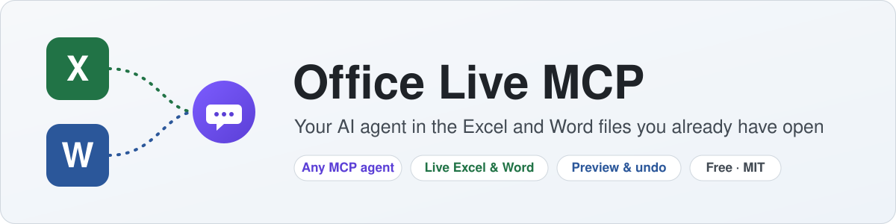

  <picture>
    <source media="(prefers-color-scheme: dark)" srcset="docs/assets/banner-dark.svg">
    
  </picture>

  
  
  
  

  
  &nbsp;
  

<b>English</b> · <a href="README.ru.md">Русский</a>

<h3 align="center">Your AI agent. Your open Excel and Word. Less manual work.</h3>

Turn spreadsheet rows into Word/PDF documents, compare registers and review Word edits — 
from the agent you already use, in the files you already have open.

https://github.com/user-attachments/assets/b5911b0d-fa66-4d23-a888-ed7adeeeea07

30-second tour: real tool calls on real Excel and Word. All data is fictional.

## Why Office Live MCP

<table>
  <tr>
    <td width="33%" valign="top">
      <h4>🤖&nbsp; Your agent, your model</h4>
      Keep your instructions and workflow. Use any model your MCP client supports.
    </td>
    <td width="33%" valign="top">
      <h4>📄&nbsp; Excel → Word → PDF</h4>
      One document per spreadsheet row from your template — with file names and conflicts previewed first.
    </td>
    <td width="33%" valign="top">
      <h4>🛡️&nbsp; Access you control</h4>
      Read-only mode, allowed folders and enabled tools — enforced by the server, not by a prompt.
    </td>
  </tr>
  <tr>
    <td width="33%" valign="top">
      <h4>👀&nbsp; Changes you can see</h4>
      Works in the documents already open, unsaved edits included. Results appear on screen at once.
    </td>
    <td width="33%" valign="top">
      <h4>↩️&nbsp; Review and undo</h4>
      Word edits are previewed and recorded as tracked revisions. Journal and undo, with conflict checks.
    </td>
    <td width="33%" valign="top">
      <h4>🔓&nbsp; Free and open</h4>
      No server subscription, MIT source. One installer — no Python, no admin rights.
    </td>
  </tr>
</table>

  <b>Works with</b>&nbsp; Claude Code · Claude Desktop · Cursor · Codex CLI · ZCode · VS Code 
  and other MCP clients

## Try it on a real task

| Ask your agent | You get |
|---|---|
| *“Generate Word documents and PDFs from this register using my template. Show the plan first.”* | [A document per row, previewed before generation](docs/examples/register-to-acts.md). Codes such as `007` stay text. |
| *“Compare these two registers by code and show what changed.”* | [Differences matched by key](docs/examples/compare-registers.md). |
| *“Read the comments in Word and propose edits. Apply them after I approve.”* | [Targeted edits recorded as tracked revisions](docs/examples/comments-to-tracked-edits.md). |

**123 tools** for Excel, Word and document workflows — formulas, data cleanup, goal seek, pivots, charts, templates,
comment threads and more. [Full catalog →](docs/TOOLS.md)

## Install

> **Requirements:** Windows 10/11 (64-bit) and desktop Excel and/or Word.

1. **Download** the installer (`…-setup.exe`) from the [latest release](https://github.com/mikhalchankasm/office-live-mcp/releases/latest).
2. **Run it:** Next → Next → Finish. On a fresh install, detected agents are preselected; choose **full** or **read-only** access.
3. **Restart your agent** and ask: *“show me which workbooks are open in Excel”*.

**Update:** run the new setup.exe over the old one. **Uninstall:** Settings → Apps → Office Live MCP.
**Data and costs:** the server runs locally, without an Office add-in; what your agent reads goes to its model provider,
and the agent and model are billed under that provider's terms.

## Learn more

[Full documentation](docs/DETAILS.md) · [Tool catalog](docs/TOOLS.md) · [Changelog](CHANGELOG.md) ·
[Comparison with Claude, ChatGPT and other MCP servers](docs/DETAILS.md#how-it-compares) · [MIT license](LICENSE)
